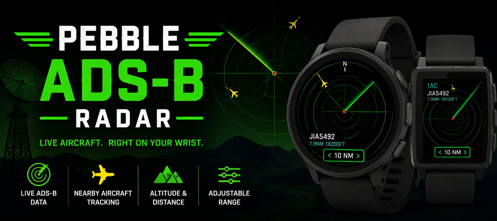

# Pebble ADS-B Radar




A live ADS-B aircraft radar application for **Pebble Round 2** and
**Pebble Time 2**. The connected phone retrieves nearby aircraft from
the ADS-B.fi API, filters and compresses the data, then sends a compact
aircraft list to the watch for rendering on a smooth animated radar
display.

------------------------------------------------------------------------

# What's New in v1.1.0

-   Live ADS-B mode restored as the default
-   Adjustable 5, 10, 20 and 40 NM radar ranges
-   Automatic highlighting of the closest aircraft
-   Callsigns shown for every visible aircraft
-   Improved aircraft-shaped markers with heading indication
-   Cleaner label placement optimized for round displays
-   Improved phone/watch messaging reliability
-   Updated documentation and screenshots

------------------------------------------------------------------------

# Features

-   Live ADS-B.fi aircraft data
-   Phone GPS location
-   Animated radar sweep
-   Five evenly spaced radar range rings
-   Adjustable 5 / 10 / 20 / 40 NM ranges
-   Up to 8 nearby aircraft
-   Automatic nearest-aircraft selection
-   Callsigns for every visible aircraft
-   Distance and altitude shown for the selected aircraft
-   Aircraft count indicator
-   Directional aircraft symbols
-   Pebble Round 2 and Pebble Time 2 support

# Watch Controls

  Button   Action
  -------- ----------------------
  Up       Increase radar range
  Down     Decrease radar range

Ranges:

``` text
5 → 10 → 20 → 40 NM
```

# Radar Display

-   Red center marker = your position
-   Yellow aircraft = nearby traffic
-   Closest aircraft emphasized with a thicker marker
-   Callsigns displayed for all visible aircraft
-   Distance and altitude displayed for the closest aircraft
-   Five evenly spaced range rings
-   North indicator at the top
-   Aircraft count in the upper-left corner
-   Current radar range shown in a badge at the bottom

# Architecture

``` text
ADS-B.fi
     │
 Phone GPS
     │
 Phone (PKJS)
  • Fetch aircraft
  • Calculate distance/bearing
  • Filter & sort
  • Compress payload
     │
 AppMessage
     │
 Pebble Watch
  • Parse aircraft
  • Draw radar
  • Animate sweep
```

# Building

``` bash
pebble clean
pebble build
```

The compiled `.pbw` file is created in the `build/` directory.

# Installation

## Emulator

``` bash
pebble install --emulator gabbro
```

or

``` bash
pebble install --emulator emery
```

## Physical Watch

``` bash
export PEBBLE_PHONE=<phone-ip>
pebble install
```

# Configuration

``` javascript
const RADAR_RANGES_NM = [5, 10, 20, 40];
const DEFAULT_RANGE_INDEX = 1;
```

Default range is **10 NM**.

Phone refresh interval:

``` javascript
const REFRESH_MS = 7200;
```

# Troubleshooting

## No aircraft displayed

-   Verify phone location permissions.
-   Ensure aircraft exist within the selected range.
-   Confirm internet connectivity.
-   Check Pebble logs.

## Waiting for phone

Verify AppMessage keys match between the phone and watch.

# Planned Features

-   Aircraft detail screen
-   Ground speed display
-   Aircraft registration and type
-   Save radar range between launches
-   Configurable refresh interval
-   Aircraft trails
-   Sweep "blip" effect
-   Altitude-based marker colors

# Privacy

The application uses the connected phone's current location only to
retrieve nearby aircraft. No location history is intentionally stored.

# License

MIT License

# Author

**Jason Marquette**

GitHub: https://github.com/jasonmarquette
